# SecureScout

A self-hosted security dashboard for monitoring your web services. Checks SSL certificates, security headers, WAF detection, DNS security (DNSSEC, CAA, SPF, DMARC), server info, and browser support — all from a single page.

  

## Screenshots

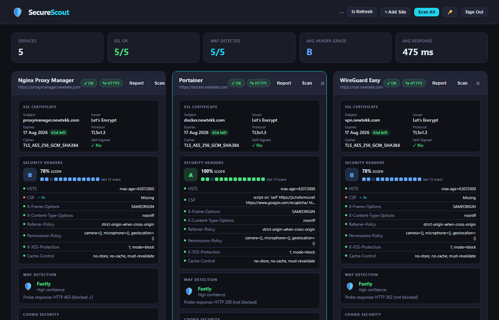
*5 services monitored — SSL, WAF, security headers graded A–F, sparkline history per service*

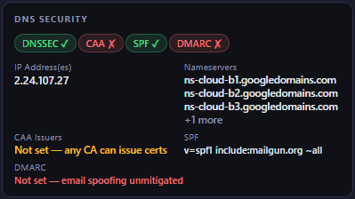
*DNS Security section — DNSSEC, CAA, SPF, DMARC badges, and DKIM selector checker*

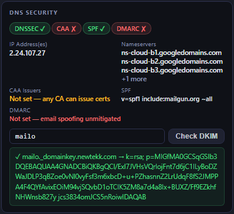
*DKIM check — enter a selector, result shows the full public key record inline*

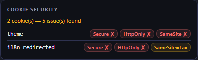
*Cookie Security — Secure, HttpOnly, SameSite flags per cookie with issue count*

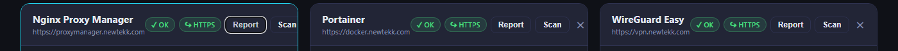
*HTTP→HTTPS redirect badge — green ↪ HTTPS when port 80 redirects correctly, red when missing*

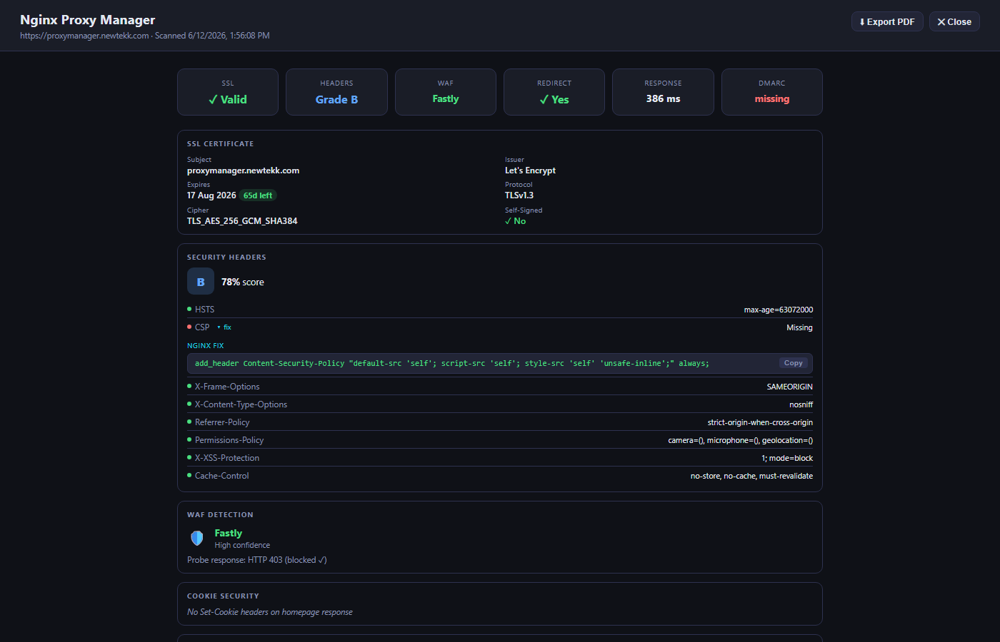
*Full-screen detail view — 6-metric scorecard, all sections expanded, header fix directives pre-opened*

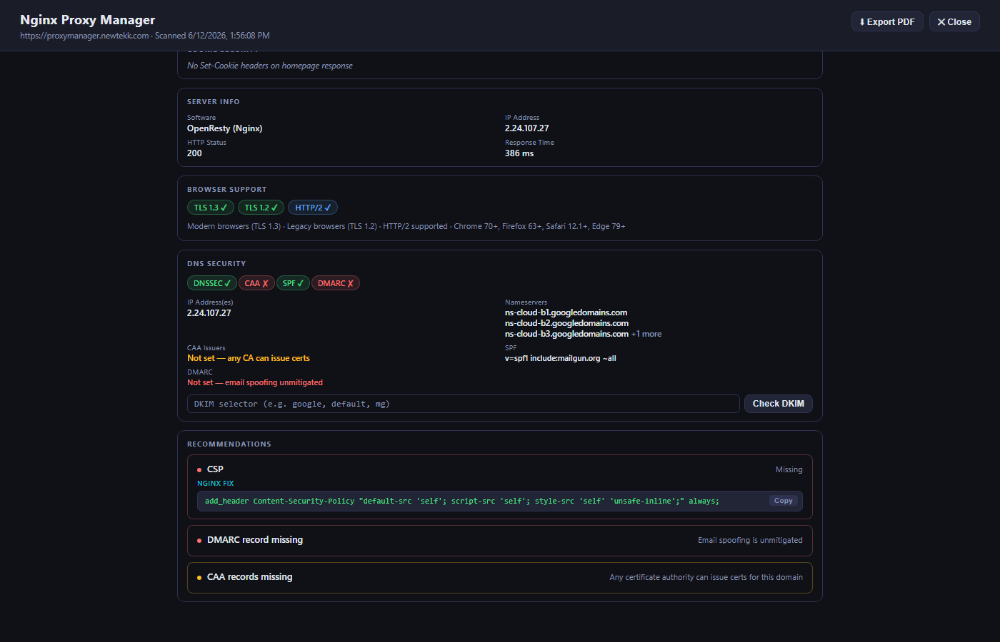
*Recommendations panel — aggregates every failing check with copy-ready Nginx fix directives*

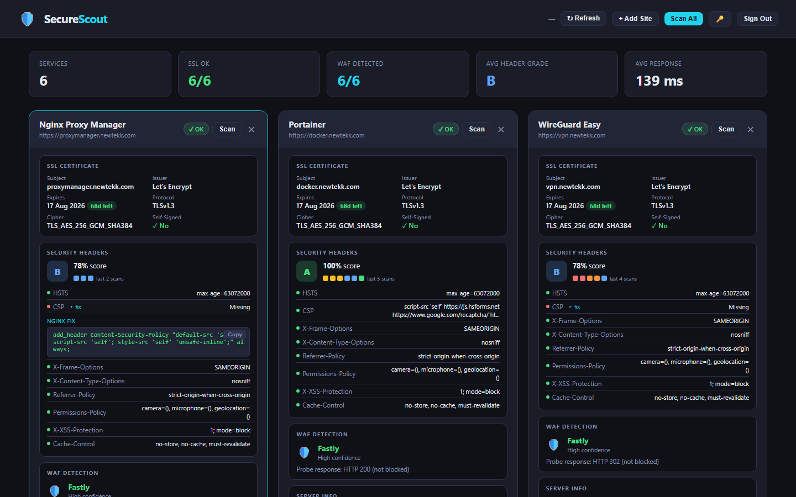
*Click any failing header to expand a copy-ready Nginx directive*

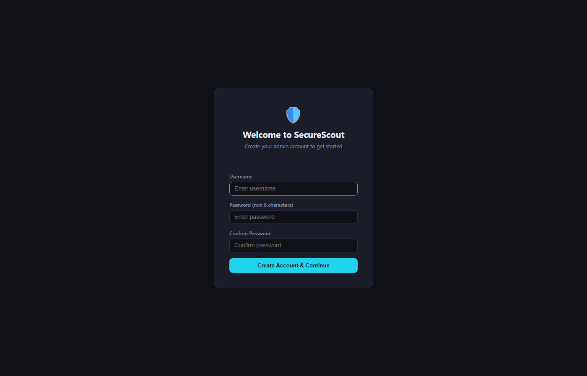
*First-run setup — create your admin account with username + password*

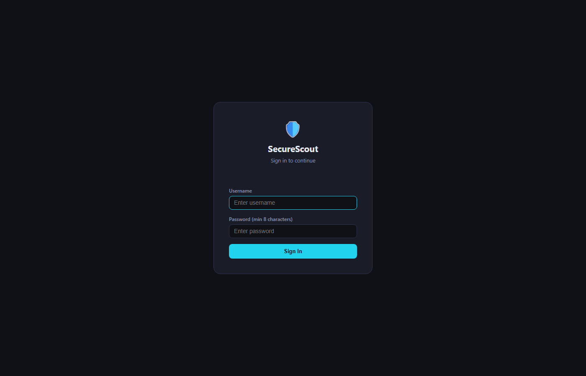
*Login screen — username and password, 24hr session tokens*

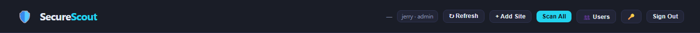
*Admin header — shows logged-in user, role, and admin-only controls*

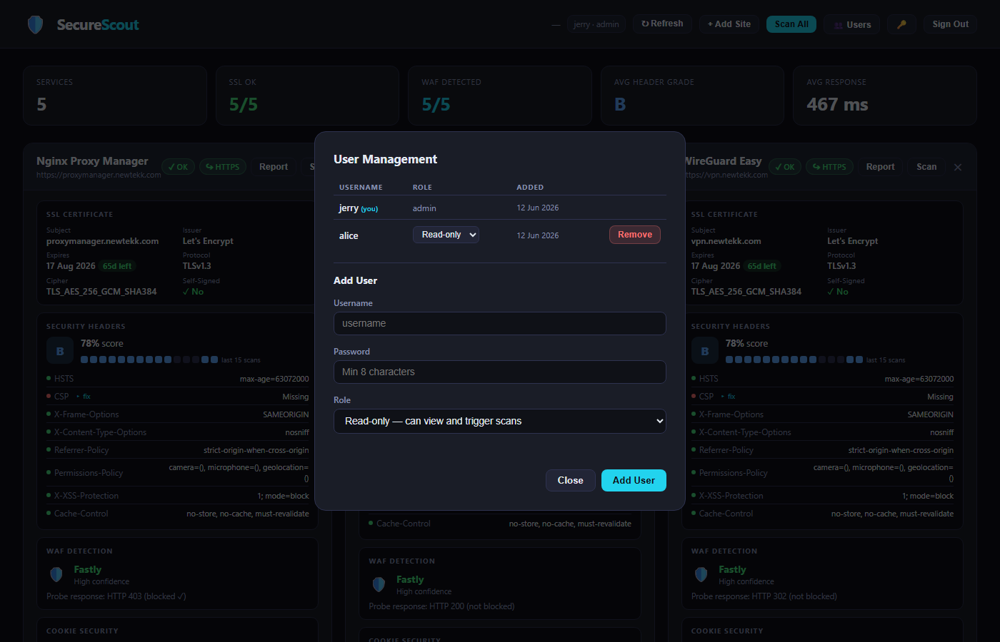
*User Management modal — add users, set roles, remove accounts*

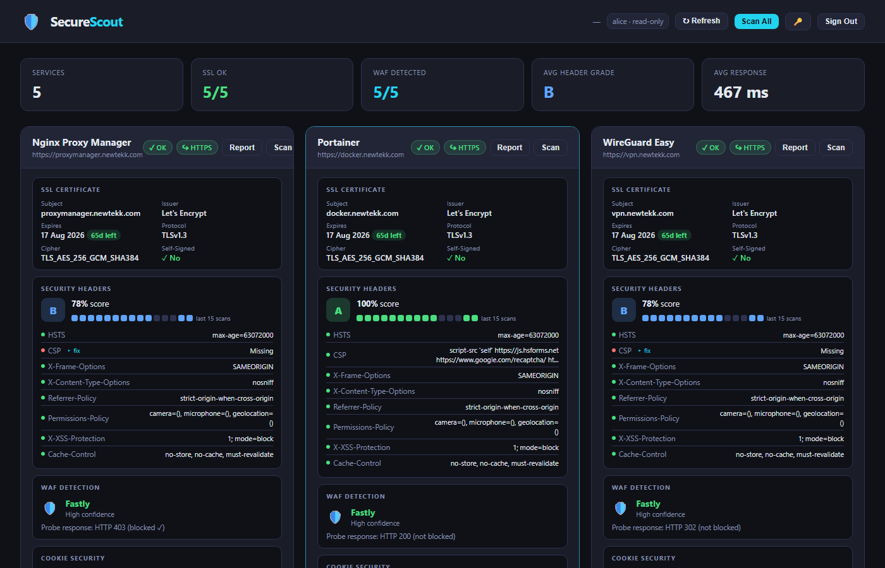
*Read-only user view — no Add Site, no Remove buttons; can scan but not modify*

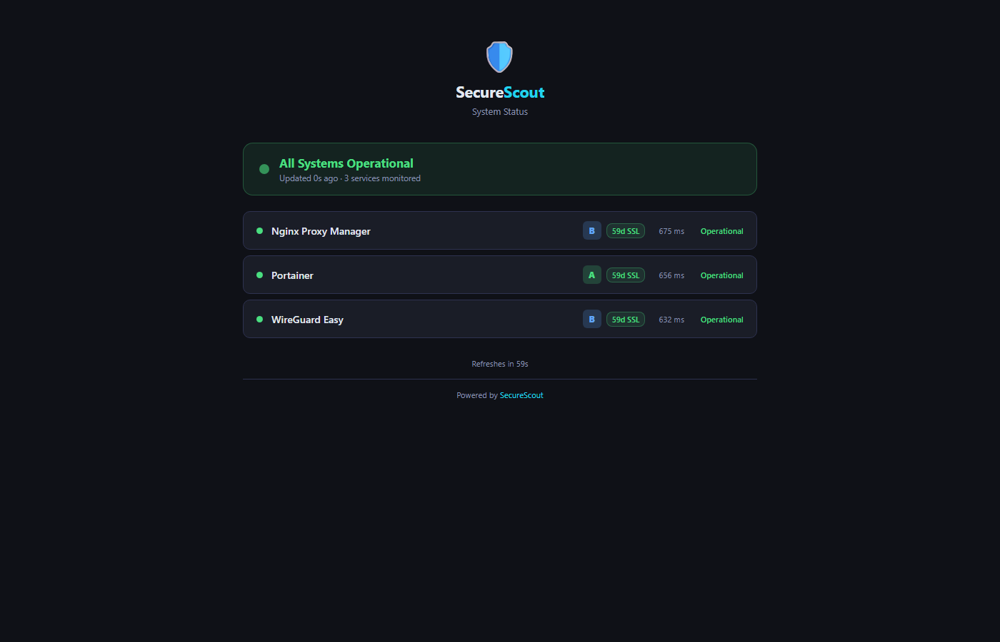
*Public status page (/status) — no login required; operational status, grade, SSL countdown, and response time per service*

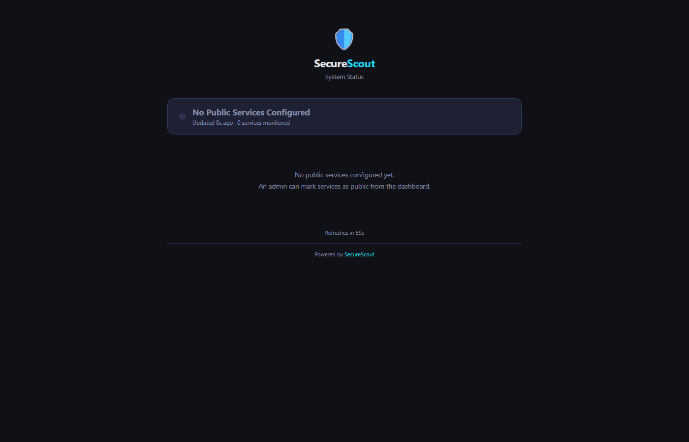
*Status page before any services are marked public — neutral empty state*


*🌐 globe button on each card (admin only) — lit cyan when public, dimmed when private*

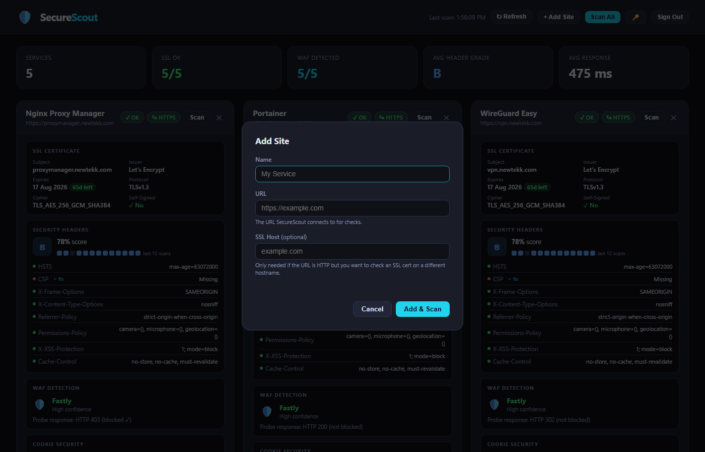
*Add any service on the fly — scans immediately and persists to config*

## Features

- **SSL Certificate** — expiry countdown, issuer, cipher suite, protocol, self-signed detection
- **Security Headers** — grades A–F across 8 headers (CSP, HSTS, X-Frame-Options, X-Content-Type-Options, Referrer-Policy, Permissions-Policy, X-XSS-Protection, Cache-Control)
- **WAF Detection** — fingerprints Cloudflare, AWS WAF, Sucuri, Imperva, Akamai, F5 BIG-IP, Barracuda, Fastly; fires a live XSS + SQLi probe to test blocking
- **DNS Security** — DNSSEC, CAA issuers, SPF, DMARC (policy: reject/quarantine/none), and on-demand DKIM selector lookup
- **Cookie Security** — Secure, HttpOnly, SameSite flags per cookie; session-like names highlighted; issue count summary
- **HTTP→HTTPS Redirect** — checks whether plain HTTP (port 80) redirects to HTTPS; green badge in card header when working, red when missing
- **Full-screen Detail View** — click any card title or the Report button to open a full-screen overlay with a 6-metric scorecard, all sections expanded, and a Recommendations panel aggregating every failing check with copy-ready Nginx fixes
- **PDF Export** — Export PDF button renders a clean white-background report via the browser print dialog; all badges and code blocks styled for print
- **Server Info** — software, IP address, HTTP status, response time, X-Powered-By
- **Browser Support** — TLS 1.2/1.3 and HTTP/2 probed directly, with human-readable compatibility notes
- **Fix Recommendations** — click any failing header to expand a copy-ready Nginx directive
- **Scan History** — grade sparkline per service showing trend across last 15 scans
- **Discord Alerts** — notifies on site down/up, SSL expiry < 30 days, header grade drop
- **Public Status Page** — unauthenticated `/status` page shareable with anyone; admin toggles per-service visibility with the 🌐 button; shows operational/degraded/outage status, grade, SSL countdown, and response time; auto-refreshes every 60 seconds
- **Multi-user Accounts** — admin creates named user accounts; two roles: `admin` (full access) and `read-only` (view + trigger scans, no service modification); user management modal with inline role change and remove
- **Password Protection** — scrypt-hashed passwords with 24hr session tokens; per-user sessions invalidated on removal

## Tech Stack

- Node.js 20+ (stdlib only — zero npm dependencies)
- Vanilla JS frontend, no frameworks
- Single page: `server.js` + `index.html` + `config.json`

## Getting Started

### 1. Clone the repo

```bash
git clone https://github.com/jerryhobson-datageek/securescout.git
cd securescout
```

### 2. Configure your services

Edit `config.json`:

```json
{
  "port": 3002,
  "scanIntervalMinutes": 60,
  "discordWebhook": "",
  "services": [
    {
      "name": "My Site",
      "url": "https://example.com"
    },
    {
      "name": "Internal Service",
      "url": "http://localhost:8080",
      "sslHost": "example.com"
    }
  ]
}
```

| Field | Description |
|---|---|
| `port` | Port the dashboard listens on |
| `scanIntervalMinutes` | Auto-rescan interval in minutes (0 = disabled) |
| `discordWebhook` | Discord webhook URL for alerts (optional) |
| `services[].url` | URL SecureScout connects to for checks |
| `services[].sslHost` | Override hostname for SSL check (useful for internal/proxied URLs) |

### 3. Run

```bash
node server.js
```

Open `http://localhost:3002` in your browser. On first visit you will be prompted to create an admin account (username + password). After that, log in normally — additional users can be added from the Users button in the header.

## User Management

SecureScout supports multiple named user accounts with two roles:

| Role | Can do |
|---|---|
| `admin` | View, scan, add/remove services, manage users, change any password |
| `read-only` | View dashboard, trigger scans — cannot add/remove services or manage users |

On first run you create an **admin** account. After logging in, click **👥 Users** in the header to:
- Add new users and assign a role
- Change an existing user's role inline
- Remove a user (their sessions are immediately invalidated)

Admins cannot remove themselves or change their own role (to prevent accidental lockout).

## Deployment (systemd)

```bash
# Copy files to running directory
cp server.js index.html /opt/securescout/
# config.json — copy only on first deploy, never overwrite

# Create systemd service
cat > /etc/systemd/system/securescout.service << EOF
[Unit]
Description=SecureScout Security Dashboard
After=network.target

[Service]
Type=simple
User=www-data
WorkingDirectory=/opt/securescout
ExecStart=/usr/bin/node /opt/securescout/server.js
Restart=on-failure
RestartSec=5

[Install]
WantedBy=multi-user.target
EOF

systemctl daemon-reload
systemctl enable --now securescout
```

## Running Behind Nginx Proxy Manager (Docker)

If NPM runs in Docker, `localhost` inside the container refers to the container itself — use the Docker bridge gateway IP to reach the host:

```
Forward Host: 172.17.0.1
Forward Port: 3002
```

If the service URL loops back through NPM (causing a 502), set the URL to the internal address and use `sslHost` to still check the public SSL cert:

```json
{
  "name": "Nginx Proxy Manager",
  "url": "http://localhost:80",
  "sslHost": "proxymanager.newtekk.com"
}
```

## Discord Alerts

Add your webhook URL to `config.json`:

```json
"discordWebhook": "https://discord.com/api/webhooks/..."
```

Alerts fire when:
- A site goes **down** or comes back **up**
- An SSL cert crosses below **30 days** remaining
- A security header **grade drops** (e.g. C → F)

## API Endpoints

All endpoints except `/api/login`, `/api/setup`, and `/api/status` require a valid `Authorization: Bearer <token>` header.

| Endpoint | Method | Description |
|---|---|---|
| `GET /` | GET | Dashboard UI |
| `GET /api/status` | GET | Auth status — returns `setupDone`, `authenticated`, `role`, `username` |
| `POST /api/setup` | POST | Create initial admin account (first run only) |
| `POST /api/login` | POST | Authenticate and get session token |
| `POST /api/logout` | POST | Invalidate session token |
| `POST /api/change-password` | POST | Change own password |
| `GET /api/public/status` | GET | Public status JSON — no auth required |
| `GET /status` | GET | Public status page — no auth required |
| `GET /api/users` | GET | List all users — admin only |
| `POST /api/users` | POST | Create a user — admin only |
| `DELETE /api/users` | DELETE | Remove a user — admin only |
| `PATCH /api/users` | PATCH | Change a user's role — admin only |
| `GET /api/services` | GET | List configured services |
| `PATCH /api/services` | PATCH | Toggle public visibility on a service — admin only |
| `POST /api/services` | POST | Add a service and trigger scan |
| `DELETE /api/services` | DELETE | Remove a service |
| `GET /api/scan/all` | GET | Scan all services |
| `GET /api/scan?url=` | GET | Scan a single service |
| `GET /api/results` | GET | Return cached scan results |
| `GET /api/history` | GET | Return scan history (last 30 per service) |
| `GET /api/dkim?domain=&selector=` | GET | Check DKIM record for a domain/selector pair |

## WAF Detection Method

SecureScout uses two techniques:

1. **Header fingerprinting** — checks response headers for known WAF signatures (e.g. `CF-Ray` for Cloudflare, `X-Sucuri-ID` for Sucuri, `X-Served-By` for Fastly)
2. **Probe request** — sends a URL-encoded XSS + SQLi payload and checks if the response is blocked (HTTP 403/406/429/444)

## License

MIT
